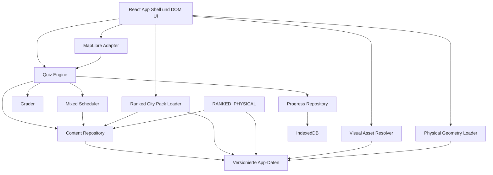

# Technische Architektur

## Stackentscheidung für den MVP

| Bereich | Entscheidung |
|---|---|
| App | React + TypeScript + Vite |
| Kartenrenderer | MapLibre GL JS |
| Quizlogik | pures TypeScript, UI-unabhängig |
| Datenvalidierung | Laufzeitschemas plus TypeScript-Typen |
| Lokale Persistenz | IndexedDB mit dünnem Repository-Layer |
| Account-/Sync-Backend | optionaler Supabase-Adapter + Postgres/RLS-Migration |
| Routing | clientseitige Hash-Routen inklusive Fortschritt, Abzeichen und Konto |
| Tests | Unit/Contract, React-Integration und Browser-End-to-End |
| Auslieferung | zuerst GitHub Pages, später austauschbarer statischer Host |

Konkrete Paketversionen werden beim Scaffold festgesetzt und danach über
Lockfile und automatisierte Updates kontrolliert. Der öffentliche Basispfad ist
eine Build-Variable; Details stehen in [`DEPLOYMENT.md`](DEPLOYMENT.md).

## Warum kein Phaser

Die dominante Oberfläche besteht aus Navigation, Formularen, Lernstatistiken,
Text und einer geographischen Karte. MapLibre löst Kartenprojektion,
GeoJSON-/Vector-Tile-Layer, Hit-Testing, Zoom und Touchinteraktion bereits
gezielt. Ein zusätzlicher Spiele-Canvas würde zwei Render- und Eingabesysteme
ohne ausreichenden Nutzen erzeugen.

Die spielerischen Regeln bleiben dennoch wie bei einem guten Browsergame von
Rendering und UI getrennt.

## Systemgrenzen



### Eigentümerschaft

- **Quiz Engine:** Rundenstatus, Reihenfolge, Timerereignisse, Auswertung,
  Scoring, Feedback und Abschluss.
- **Mixed Scheduler:** reproduzierbare Poolzuteilung und globale Reihenfolge;
  die fachlichen Fragen erzeugen weiterhin die normalen Generatoren.
- **Grader:** fachliche Bewertung eines Antwort-Payloads.
- **Content Repository:** Entitäten, Namen, Relationen, Geometrie-Referenzen und
  Quiz-Presets.
- **Visual Asset Resolver:** stabile Asset-Schlüssel in
  GitHub-Pages-taugliche lokale URLs übersetzen und die für eine konkrete
  Runde benötigten SVGs vorladen.
- **Physical Geometry Loader:** die in einer konkreten Runde benötigten
  versionierten Punkt-, Linien- und Flächenpakete dynamisch laden.
- **Ranked City Pack Loader:** den validierten 6000-Städte-Pack nur für
  Stadtsetup, Stadtfragen oder vorhandenen Stadtlernstand laden und mit dem
  Kern-Dataset zu einem normalen Content Repository verbinden.
- **Ranked Physical Pack Loader:** 100 Flusssysteme und 100 Gipfel samt
  Fakten nur für die beiden Rangthemen oder vorhandenen Lernstand laden und
  über denselben Repositoryvertrag bereitstellen.
- **Progress Repository:** Sessions, Versuche, Einstellungen und Lernstand.
- **Map Adapter:** Layer, Kamera, Auswahlereignisse und visuelles Feedback.
- **React:** Darstellung, Navigation, Dialoge und barrierefreie Steuerung.

React-Komponenten importieren keine Rohdatendateien. MapLibre-Layer schreiben
keinen Lernstand. Repositorys kennen keine UI-Komponenten.

### Erweiterungs-Registries

- `entityTypeRegistry`
- `relationTypeRegistry`
- `promptRendererRegistry`
- `answerModeRegistry`
- `graderRegistry`
- `progressEventRegistry`
- `achievementAggregatorRegistry`

Registries werden beim Start vollständig aufgebaut und gegen Content-Manifeste
geprüft. Unbekannte IDs führen zu einem klaren Build-/Startfehler, nicht zu
einer halb funktionierenden Frage. Themenmodule registrieren ihre Fähigkeiten
an einer Stelle; die Session-Engine kennt keine Themenliste.

## Vorgesehene Projektstruktur

```text
src/
├── app/                     App-Shell, Routing, Provider
├── features/
│   ├── quiz-setup/          Konfigurator und Presets
│   ├── quiz-session/        Runde, HUD, Feedback
│   ├── results/             Ergebnis und Fehleranalyse
│   ├── progress/            Lernstand und Wiederholung
│   ├── account/             Profil, Auth und Syncstatus
│   └── achievements/        Sammlung und Freischaltfeedback
├── engine/
│   ├── quiz/                Zustandsautomat und Generator
│   ├── mixed/               gewichtete Poolplanung
│   ├── graders/             text, map-point, map-area, map-line, choice
│   ├── scoring/             versionierte Bewertungsprofile
│   ├── achievements/        regelbasierte Ereignisauswertung
│   └── random/              deterministische Zufallsquelle
├── geo/
│   ├── map-adapter/         MapLibre hinter eigener Schnittstelle
│   ├── geometry/            Distanz, Bounds, Hit-Testing
│   └── projections/         explizite Kartenkonventionen
├── content/
│   ├── schema/              Entitäten, Relationen, Manifeste
│   ├── repositories/        Zugriff statt direkter JSON-Imports
│   ├── presets/             Quiz- und Mixed-Definitionen
│   └── derived-questions/   kompilierte Wissenspuzzles
├── persistence/
│   ├── schema/              Browser-Datenbank und Migrationen
│   ├── repositories/
│   └── sync/                Outbox, Import-Batches und Konfliktregeln
├── ui/
│   ├── components/          wiederverwendbare UI-Primitiven
│   ├── tokens/              Design Tokens
│   └── a11y/                Fokus- und Live-Region-Helfer
└── test/
    ├── fixtures/
    └── builders/

data-pipeline/
├── sources/                 Download-/Importadapter
├── transforms/              Normalisierung und Verknüpfung
├── validators/              fachliche und strukturelle Prüfungen
├── question-compiler/       Wissenspuzzles und Erklärungen
├── achievements/            Familiengenerator und Regelprüfung
└── build/                   App-Artefakte und Manifest

public/data/<dataset-version>/
├── manifest.json
├── entities/
├── relations/
├── geometries/
└── assets/
```

## Engine als Zustandsautomat

Ein serialisierbarer Reducer oder kleiner Zustandsautomat erhält Ereignisse:

```ts
type QuizEvent =
  | { type: "START"; definitionId: string; seed: string }
  | { type: "CONTENT_READY"; questions: QuestionInstance[] }
  | { type: "ANSWER"; payload: unknown; atMs: number }
  | { type: "TIME_EXPIRED"; atMs: number }
  | { type: "CONTINUE" }
  | { type: "PAUSE" }
  | { type: "RESUME" }
  | { type: "ABANDON" };
```

Der Timer wird nicht nur optisch heruntergezählt. Die Engine bewertet anhand
monotoner Zeitwerte und Ereignisse, damit Hintergrundtabs und langsame Geräte
keinen falschen Zustand erzeugen.

### Phase-4/5-Rundengrenze

`QuizRoundDefinition` ist die persistierbare Union aus einer einzelnen
`QuizDefinition` und einer `MixedQuizDefinition`. Ein Mixed-Pool enthält eine
vollständige normale Definition. Der Scheduler teilt nur die Fragenanzahl zu,
ruft die vorhandenen Generatoren auf und setzt danach globale Ordinale sowie
`sourcePoolId`. Dadurch entstehen weder ein Weltmix-Grader noch duplizierte
Themenregeln.

Visuelle `QuestionInstance`-Snapshots enthalten ausschließlich Asset-Schlüssel,
Art und Entitäts-ID. URLs, SVG-Markup und der öffentliche Vite-Basispfad bleiben
außerhalb der Engine. Vor `START` lädt die React-Schicht nur die in der fertigen
Runde referenzierten Einzeldateien; der Service Worker kann sie anschließend
unter demselben versionierten Pfad zwischenspeichern.

Physische `QuestionInstance`-Snapshots enthalten Entitätstyp, Ziel-ID und eine
repräsentative Zielkoordinate, aber keine Rohgeometrie. Vor `START` lädt die
React-Schicht nur die physischen Themenpakete, die in der erzeugten Einzel- oder
Mixed-Runde vorkommen. Der Kartenadapter rendert sie und löst Flussklicks per
projizierter Segmentdistanz auf; `line-v1` sieht ausschließlich die gewählte
stabile Entitäts-ID.

### Phase-7-Städtegrenze

Der synchrone Kern enthält den registrierten Typ `ranked_city`, aber keine
Stadtinstanzen. Setup und Sessionvorbereitung erkennen Definitionen mit diesem
Typ und laden dann `ranked-cities-v1.json` dynamisch. Die Zusammenführung
geschieht vor der deterministischen Fragenerzeugung; Generator, Grader,
Fortschritt, Abzeichen und Persistenz sehen anschließend nur das vorhandene
Repository- beziehungsweise Sessionformat.

Die kleine Startseitenübersicht importiert denselben Pack und baut daraus
einen lokalen Suchindex sowie 1000 Vorschaupunkte. Nur diese Übersicht
verwendet MapLibre-Clustering. Eine Kartenfrage enthält weiterhin genau eine
individuelle Zielkoordinate und wird weder im Enginezustand noch in der
Bewertung zu einem Cluster. Damit bleiben Simulation und Rendering getrennt.

Ein kompletter Top-1000-Fragensnapshot wird als normale pausierte Session in
IndexedDB gespeichert. Pause wartet vor der Navigation auf den bestätigten
Schreibabschluss; Fortsetzen verwendet dieselbe Session-ID und benötigt keine
Marathon-Sondermaschine.

### Phase-7-Physikranglistengrenze

Der synchrone Kern registriert `ranked_river` und `ranked_peak`, enthält aber
keine Instanzen oder Rangfakten. Eine Definition mit einem dieser Typen lädt
`ranked-physical-v1.json` vor Validierung und Fragenerzeugung dynamisch. Falls
eine Fehlerwiederholung Städte und Physikranglisten kombiniert, werden beide
Packs parallel geladen und einmalig mit dem Kern zusammengeführt.

Der `fact`-Prompt ist Engine-Logik: Er löst registrierte Fakt-IDs im Repository
auf und serialisiert nur Label und formatierten Wert in die Frage. React kennt
weder Rangmethode noch richtige Antwort und rendert lediglich dieses Profil.
Das Paket enthält keine Flussgeometrien; Natural-Earth-Kartenpakete und
Wikipedia-Ranglisten bleiben getrennte Verantwortlichkeiten.

## Kartenarchitektur

- MapLibre wird über einen eigenen `MapAdapter` gekapselt.
- Layer- und Source-IDs sind stabile Manifest-Keys.
- Quizantworten liefern Entitäts-IDs; Renderer-Feature-IDs werden im Adapter
  übersetzt.
- Hover, Auswahl, korrekte Lösung und Fehler sind getrennte Feature-States.
- Kameraänderungen sind Effekte der Session, nicht Teil der fachlichen Lösung.
- Flächen treffen gerenderte Feature-IDs; Linien treffen die nächste
  projizierte Feature-ID innerhalb einer geräteabhängigen Pixeldistanz.
- MVP-Geometrien können als optimiertes GeoJSON ausgeliefert werden.
- Bei größeren Datenmengen wird auf selbst gehostete Vector Tiles/PMTiles
  gewechselt, ohne die Quiz-Engine zu ändern.
- Attribution bleibt sichtbar und kommt aus dem Dataset-Manifest.

Für den ersten Schnitt reicht eine bewusst reduzierte Lernkarte aus lokal
ausgelieferten Geometrien. Die App hängt damit weder von einem kommerziellen
Tile-Key noch von der Verfügbarkeit eines fremden Kartenservers ab.

## Lokaler und später synchronisierter Zustand

### MVP

- Lokales Gastprofil.
- Repository-Schnittstellen vor IndexedDB.
- Jede Schreiboperation ist idempotent oder hat eine stabile Ereignis-ID.
- Export/Import als Sicherheitsnetz.

### Phase-3-Synchronisationskern

- Supabase Auth und Sync hinter `AuthAdapter` und `SyncAdapter`.
- Der Client wird nur auf der lazy geladenen Kontoseite und nur bei gesetzter
  öffentlicher Konfiguration importiert.
- IndexedDB v3 schreibt jedes neue Progress Event zusätzlich in eine Outbox.
- Eine stabile Import-Batch-ID macht RPC-Wiederholungen wirkungsgleich.
- Der Server setzt `profile_id` ausschließlich aus `auth.uid()` und exponiert
  nur RLS-geschützte Lesezugriffe.
- Serverseitige Datensätze bleiben öffentlich lesbar und versioniert.
- Nutzerdaten sind per Row Level Security getrennt.
- Fortschrittsereignisse erhalten clientseitig stabile IDs und werden
  idempotent eingefügt.
- Konflikte werden pro Session/Ereignis zusammengeführt; kein blindes
  „letzter Schreibvorgang gewinnt“ für Lernhistorie.
- Mastery, Statistiken und Achievement-Fortschritt bleiben wiederaufbaubar.

Der echte Zwei-Konten- und Mehrgerätetest benötigt ein verbundenes
Supabase-Projekt und ist weiterhin ein externes Phase-3-Gate.

## UI- und Designgrenzen

- Quiztext, Timer, Eingabe, Einstellungen und Feedback sind DOM-Oberflächen.
- Karte bleibt die große, geschützte Spielfläche.
- Mobil: HUD kompakt, primäre Eingabe im Daumenbereich, Karte nicht von
  Dauerpanels verdeckt.
- Desktop: Karte und Frage bilden eine klare Hauptachse; Statistiken bleiben
  sekundär.
- Die visuelle Richtung wird vor dem Scaffold als vollständiges Konzept für
  Start/Setup, Kartenrunde, Texteingabe, Feedback, Ergebnis und Mobilansicht
  festgelegt. Erst danach werden Tokens und Komponenten gewählt.

## Performanceziele

- Initial nur das für Start und Setup nötige JavaScript laden.
- Karten- und Inhaltsdaten nach Gebiet/Modus laden.
- Kein vollständiger Welt-Städtedatensatz im ersten Bundle.
- Geometrien für die jeweilige Zoomstufe vereinfachen.
- Wiederholte Runden verwenden Browser-Cache und lokale Indizes.
- Ziel: Eingabe-zu-Feedback ohne wahrnehmbare Verzögerung; Kartenauswahl bleibt
  auch auf durchschnittlichen Mobilgeräten flüssig.

Die erste Build-Baseline und vorläufige Bytebudgets stehen in
[`PERFORMANCE.md`](PERFORMANCE.md). Zeitbudgets werden vor dem Phase-0-Gate auf
einem realen mittleren Mobilgerät ergänzt.

## Sicherheit und Datenschutz

- MVP ohne Konto und ohne notwendiges Tracking.
- Keine geheimen Schlüssel im Client.
- Externe Datenimporte laufen als Build-Prozess, nicht aus dem Browser.
- Persistierte Payloads werden beim Lesen und Schreiben validiert.
- Exportdateien enthalten klar sichtbar, welche persönlichen Lernwerte sie
  umfassen.
- Spätere Telemetrie ist sparsam, dokumentiert und zustimmungsfähig.
