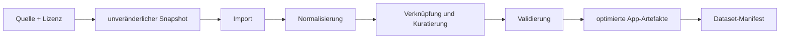

# Content- und Geodaten-Pipeline

## Grundsatz

Externe Quellen werden nicht direkt während einer Quizrunde abgefragt. Ein
reproduzierbarer Build lädt Snapshots, normalisiert sie in das interne Modell,
validiert sie und erzeugt kleine, versionierte App-Artefakte.



## Vorgesehene Quellen

| Bedarf | Primärquelle | Lizenz/Regel | Einsatz |
|---|---|---|---|
| Länderflächen, Küsten, große Flüsse/Seen | [Natural Earth](https://www.naturalearthdata.com/) | Public Domain; Quellenhinweis freiwillig, wird trotzdem geführt | Grundgeometrie und physische Layer |
| Städte, Koordinaten, alternative Namen, Bevölkerung | [GeoNames](https://www.geonames.org/export/) | CC BY; Attribution verpflichtend | Hauptstädte und versionierte Städteauswahl |
| Ergänzende stabile IDs und mehrsprachige strukturierte Fakten | [Wikidata](https://www.wikidata.org/wiki/Wikidata:Licensing) | Strukturierte Daten CC0 | kontrollierte Anreicherung, nicht ungeprüftes Live-Backend |
| Länderflaggen als lokale SVGs | [flag-icons](https://github.com/lipis/flag-icons) | MIT-Paketlizenz | gebündelte Flaggenassets |
| Vergleichbare Flächen-/Bevölkerungswerte | [World Bank Open Data](https://data.worldbank.org/) und benannte Primärquelle des Indikators | Lizenz und Methode je Indikator | versionierte Fakten für Wissenspuzzles |
| Amtssprachen und besondere Hauptstadtrollen | nationale Verfassung/Gesetz oder andere zuständige Primärquelle; Wikidata nur zur Kandidatensuche | Lizenz und Beleg je Quelle | kuratierte Relationsdaten für eindeutige Wissenspuzzles |

Natural Earth bietet Kartenmaßstäbe von 1:10m, 1:50m und 1:110m. Der Build
wählt je App-Umfang eine passende Auflösung, statt Rohdaten maximaler Größe
auszuliefern.

## Dataset-Manifest

Jeder veröffentlichte Content-Build besitzt ein maschinenlesbares Manifest:

```json
{
  "datasetId": "geo-core",
  "version": "2026-01",
  "schemaVersion": 1,
  "builtAt": "2026-07-30T12:00:00Z",
  "localeCoverage": ["de"],
  "sources": [
    {
      "id": "natural-earth",
      "sourceVersion": "5.1.0",
      "retrievedAt": "2026-07-30T10:00:00Z",
      "url": "https://www.naturalearthdata.com/",
      "license": "Public Domain",
      "checksum": "sha256:..."
    }
  ],
  "artifacts": [
    {
      "path": "entities/countries.json",
      "sha256": "...",
      "bytes": 12345,
      "entityCount": 195
    }
  ],
  "attribution": ["Made with Natural Earth", "GeoNames (CC BY 4.0)"],
  "qualityReport": "quality-report.json"
}
```

Versionen sind unveränderlich. Ein neuer Import erzeugt eine neue Version,
niemals stillschweigend andere Inhalte unter derselben URL.

## Pipeline-Schritte

### 1. Erfassen

- Quelle, Version, Abrufzeit und Lizenz vor Download registrieren.
- Rohdatei unverändert mit SHA-256-Prüfsumme ablegen.
- Manuelle Korrekturen niemals in Rohdateien schreiben.

### 2. Importieren

- Quellformat über einen eigenen Adapter lesen.
- Quell-ID und Rohwert für Rückverfolgung behalten.
- Koordinaten nach WGS84 normalisieren.
- Fehlerhafte Zeilen protokollieren; nicht still verwerfen.

### 3. Normalisieren

- Stabile interne IDs bilden.
- Entitätstypen und kanonische Relationsrichtungen setzen.
- Namen mit Locale, Art und Antwortpolicy importieren.
- Einheiten vereinheitlichen.
- Datum/Methode für veränderliche Fakten wie Bevölkerung bewahren.

### 4. Verknüpfen

- ISO-Codes, GeoNames-IDs und Wikidata-IDs bevorzugen.
- Unsichere Fuzzy-Matches werden als Review-Queue ausgegeben.
- Keine automatische Zusammenführung nur aufgrund eines gleichen Namens.
- Kuratierte Overrides liegen in einer kleinen, reviewbaren Datei mit Begründung.

### 5. Ableiten

- Normalisierte Antwortformen.
- Bounds, Zentroid und Kartenfokus.
- Schwierigkeitswerte nach dokumentierter Heuristik plus Overrides.
- Regionszugehörigkeit.
- Städte-Ranglisten pro Snapshot und klarer Populationsmethode.
- Optimierte, vereinfachte Geometrien und Kartenlayer.

### 6. Validieren

Strukturelle Prüfungen:

- Schema gültig, IDs eindeutig, Referenzen auflösbar.
- Keine Relation zu unbekannter Entität.
- Koordinaten im gültigen Bereich.
- Geometrien valide und nicht leer.
- Alle Quiz-Presets liefern genügend Kandidaten.

Fachliche Prüfungen:

- Jedes aktive Land hat deutschen Anzeigenamen, Region und Geometrie.
- Jede aktive Hauptstadt ist genau den vorgesehenen Ländern zugeordnet.
- Akzeptierte Aliasse sind innerhalb einer Frage nicht mehrdeutig.
- Bevölkerungsranglisten enthalten Snapshot, Methode und Quelle.
- Fluss- und Gebirgsnamen stimmen zwischen Entität und Kartenfeature überein.
- Vergleichbare Fakten teilen kompatible Definition, Einheit und Bezugszeit.
- Jede Wissenspuzzle-Variante hat genau die erlaubte Antwortanzahl.
- Die ausgegebene Erklärung verwendet exakt die Fakten, die zur Bewertung
  führten.
- Stichprobenlisten für sensible oder bekannte Problemfälle.

Regressionen:

- Entitäten hinzugefügt/entfernt/geändert als Diff-Bericht.
- Unerwartet starke Änderungen an Koordinaten, Bevölkerung oder Geometrie
  blockieren den Build bis zur Prüfung.
- Bestehende stabile IDs dürfen nicht durch Namensänderungen wechseln.

### 7. Paketieren

- Inhalte nach Domain, Gebiet und benötigtem Detailgrad aufteilen.
- JSON komprimierbar und cachefreundlich halten.
- Große Geometrien separat von Namen und Relationen.
- Flaggen nur einmal lokal bündeln.
- Manifest zuletzt schreiben, wenn alle Artefakte und Checks erfolgreich sind.

### 8. Fragen und Abzeichen kompilieren

- Wissenspuzzle-Templates gegen den Faktengraphen ausführen.
- Gleichstände, Nullwerte und uneindeutige Antworten ablehnen.
- Erklärung, Quellen und Fakten-Snapshot einbetten.
- Achievement-Familien in stabile Einzeldefinitionen expandieren.
- Unerreichbare, doppelte oder assetlose Abzeichen ablehnen.

## Politisch sensible Geographie

Vor einem öffentlichen Release wird eine konkrete Darstellungsregel beschlossen:

- welche Liste als „Länder“ gilt;
- Umgang mit abhängigen und umstrittenen Gebieten;
- Grenzdarstellung und Kartenhinweis;
- akzeptierte alternative Namen;
- Zuordnung transkontinentaler Länder;
- Hauptstadtfälle mit offizieller und administrativer Hauptstadt.

Die App darf diese Entscheidungen nicht in verstreuten UI-Bedingungen
verstecken. Sie gehören in Dataset-Konfiguration, sichtbare Hinweise und
Qualitätstests.

## „1000 größte Städte“

Der erste Modus wird exakt benannt:

> Top 1000 nach dem Bevölkerungsfeld des verwendeten GeoNames-Snapshots.

Das ist reproduzierbar, aber keine universelle Rangliste von Metropolregionen.
Später können getrennte Datensätze wie „Stadtgebiet“ und „Agglomeration“
hinzukommen. Sie dürfen nicht in einer Rangliste vermischt werden.

## Aktualisierungsrhythmus

- Länder/Hauptstädte/Flaggen: ereignisgetrieben plus geplanter Review.
- Stadtbevölkerung und Namen: versionierter periodischer Snapshot.
- Physische Geographie: nur bei neuer Quellversion oder Korrektur.
- Jeder Update-PR enthält Quellen-Diff, Qualitätsbericht, Lizenzprüfung und
  Stichprobenergebnis.

## Aktueller Phase-2-Schnitt

Der MVP trennt einen bewussten Netzwerkrefresh vom normalen, reproduzierbaren
Build:

```text
npm run content:refresh   # Netzwerk: Quellen neu abrufen
npm run content:build     # offline: lokalen Snapshot validieren und paketieren
```

`scripts/refresh-mvp-content.ts` und der Offline-Build kombinieren:

- `world-countries@5.1.0` unter ODbL 1.0 für ISO-Codes, Flächen,
  Regionsgrundlage, Aliasse, grobe Mittelpunkte, Amtssprachen und Währungen;
- einen am 2026-07-30 abgerufenen Wikidata-CC0-Snapshot für aktuelle deutsche
  Länder-/Hauptstadtnamen, Hauptstadtbeziehungen und Koordinaten;
- kuratierte Rollen für geteilte oder beanspruchte Hauptstadtsitze sowie
  dokumentierte Mehrfachzuordnungen transkontinentaler Staaten.

Das Ergebnis `content-src/geo-core-mvp.v1.json` ist der unveränderliche Eingang
für normale Builds. `scripts/build-content.ts` erzeugt:

- `src/content/generated/geo-core-mvp-v1.json`;
- `src/content/generated/manifest.json`;
- `src/content/generated/quality-report.json`;
- `src/geo/generated/mvp-map-additions-v1.json`.

Der Stand `2026-08-04.phase8-astronomy1` enthält 195 Länder, sechs
Kontinententitäten, 202 Hauptstadtsitze, 139 Sprachen und 146 Währungen. Alle
195 Länder besitzen ein vollständiges Profil. Die in `world-countries@5.1.0`
fehlende Währung Mikronesiens wird als USD-Korrektur mit dem Banking Board der
Föderierten Staaten von Mikronesien als Primärquelle manifestiert. Die Karte
verwendet Natural Earth 1:50m; nur das dort fehlende Tuvalu-Feature wird aus
1:10m ergänzt.

Der Offline-Eingang `content-src/astronomy-core.v1.json` ergänzt acht
Planeten, zwanzig kuratierte bekannte Monde, fünf Zwergplaneten und zwölf
Tierkreis-Sternbilder. NASA-Seiten belegen Sonnensystemfakten; die offizielle
IAU-Liste belegt Namen und Kürzel. Der Build erzeugt daraus 45 Entitäten, 110
Fakten, zwanzig `orbits`-Relationen und genau zwölf vereinfachte lokale
Sternbildkarten. Die Strichfiguren sind eigene Lernvisualisierungen und werden
nicht als offizielle IAU-Figuren bezeichnet.

Contract-Tests prüfen Schema 2, eindeutige IDs, aufgelöste Referenzen,
Koordinaten, Scopezahlen, Artefaktgrößen und SHA-256-Prüfsummen gegen das
Manifest. Der Qualitätsbericht führt Mehrhauptstadtfälle, politisch sensible
Einträge, bekannte Namensupdates und den Geometriefallback separat auf.

### Veröffentlichungspflichten

Die App zeigt Datenstand und Attribution sichtbar. Vor einem öffentlichen
Release bleibt eine gesonderte ODbL-Prüfung nötig: Der maschinenlesbare
abgeleitete Datensatz, Lizenzhinweis und etwaige Share-Alike-Pflichten müssen
für die konkrete Veröffentlichungsform abschließend geprüft werden. Siehe
`C-019` in [`Critics.md`](../Critics.md).

## Phase-4-Visual-Assets

`npm run content:build` führt vor dem Stammdatenbuild
`scripts/build-visual-assets.ts` aus:

- `flag-icons@7.5.0` liefert exakt gepinnte 4:3-SVGs unter MIT;
- ISO-2 aus dem unveränderlichen 195-Staaten-Snapshot verknüpft Flagge und
  stabile Länder-ID;
- dieselbe Natural-Earth-50m/10m-Geometrie wie die Karte wird
  antimeridiansicher in ein einheitliches 240×160-SVG eingepasst;
- `visual-assets-index-v1.json` führt Asset-Key, Entität, Art, Quelle, Pfad,
  Bytes und SHA-256;
- `public/assets/visual/v1/flags` und `outlines` enthalten jeweils 195 lokale
  Einzeldateien; `constellations` enthält zwölf generierte Lernkarten.

Der Content-Contract liest alle 402 Dateien, prüft SVG-Format, Anzahl,
eindeutige Schlüssel, Bytes und Prüfsumme. Das Dataset-Manifest nennt
`flag-icons 7.5.0 (MIT)` und Natural Earth. Zur Laufzeit wird kein CDN und keine
Live-API verwendet. Die App lädt vor einer visuellen Runde nur die im konkreten
Fragensnapshot referenzierten Dateien parallel; der Service Worker cached sie
danach unter dem aktuellen Release-Cache.

## Phase-5-Physik-Snapshot

Ein bewusster Netzwerkrefresh und der normale Offline-Build bleiben getrennt:

```text
npm run content:refresh:physical  # fünf gepinnte Natural-Earth-Layer abrufen
npm run content:build             # lokalen Snapshot validieren und paketieren
```

`content-src/physical-selection.v1.json` ist die kleine, reviewbare Auswahl mit
stabilen IDs, deutschen Namen/Aliasen, Schwierigkeit und expliziten,
überlappenden Kontinentscopes. `scripts/refresh-physical-content.ts` lädt von
`natural-earth-vector@5.1.2` die 1:50m-Layer für Flüsse, Seen, Meere,
geographische Regionen und Gipfel. Die Quelldateien werden über URL, Bytezahl
und SHA-256 im Snapshot rückverfolgbar.

Der physische Karten-Teil des aktuellen Stands
`2026-08-03.phase7-ranked-physical1` umfasst:

| Typ | Anzahl | Geometrie |
|---|---:|---|
| Fluss | 18 | `MultiLineString` |
| See | 18 | `MultiPolygon` |
| Meer | 18 | `MultiPolygon` |
| Gebirge | 18 | `MultiPolygon` |
| Gipfel | 16 | `Point` |

Der Build integriert 88 physische Entitäten in Dataset-Schema 4 und erzeugt
fünf getrennte GeoJSON-Artefakte. Dadurch lädt eine Flussrunde keine
Meerespolygone und umgekehrt. Contract-Tests prüfen Typ, deutschen Namen,
Quelle, `located_in`, Geometrieform, Artefaktzahl, Bytes und Prüfsumme.

Gleichnamige Quellfeatures werden nicht unkritisch als identisch behandelt.
Der Colorado-Fall besitzt eine explizite Quellbegrenzung; Linien-Zielpunkte
werden aus einem echten Segment gewählt. Weitere Homonyme und generalisierte
Verläufe bleiben Teil der fachlichen Review in C-051/C-055.

## Phase-6-Fakten und Wissenspuzzles

Der Faktenrefresh bleibt vom normalen Offline-Build getrennt:

```text
npm run content:refresh:knowledge  # World-Bank-Indikatoren explizit abrufen
npm run content:build              # lokalen Snapshot und Vorlagen kompilieren
```

`scripts/refresh-knowledge-content.ts` ruft für das feste Bezugsjahr 2023 die
World-Bank-Indikatoren `AG.LND.TOTL.K2` und `SP.POP.TOTL` ab, filtert sie über
die ISO-3-IDs des 195-Staaten-Scope und schreibt 388 Fakten für 194 Staaten.
Vatikanstadt besitzt in diesen Indikatoren keinen Wert. Der Snapshot ergänzt
neun kuratierte `has_official_language → language:pt`-Relationen aus den
CPLP-Mitgliedstaaten und Länderprofilen.

`content-src/knowledge-templates.v1.json` enthält 20 reviewbare, deklarative
Vorlagen. `scripts/build-content.ts` führt sie gegen Fakten, Relationen und
Namen aus. Der Build scheitert bei:

- fehlenden oder mehrfachen Filter- oder Rankingfakten;
- unterschiedlicher Quelle, Methode oder Bezugszeit;
- einem Gleichstand am Zielrang;
- unbekannten Quellen oder Evidenzreferenzen;
- leerer Kandidatenmenge oder nicht vorhandenem Rang;
- einem Antwortpfad mit null oder mehreren Relationen.

Das Ergebnis liegt gemeinsam mit Definitionen und Fakten in Dataset-Schema 4.
Zur Laufzeit gibt es keine World-Bank-, CPLP- oder KI-Abfrage. Fragetext,
Antwort-ID, Erklärung, Evidenz und Quellen sind Teil des versionierten
App-Datensatzes und des serialisierbaren Fragensnapshots.

## Phase-7-Städte-Snapshot

Der große Städtebestand hat einen eigenen, bewussten Netzwerkrefresh:

```text
npm run content:refresh:cities  # drei offizielle GeoNames-Dateien abrufen
npm run content:build           # lokalen Snapshot prüfen und paketieren
```

`scripts/refresh-ranked-cities.ts` lädt ausschließlich von
[download.geonames.org](https://download.geonames.org/export/dump/). Das
[offizielle Format-Readme](https://download.geonames.org/export/dump/readme.txt)
definiert unter anderem ID, Namen, Koordinaten, Featureklasse/-code,
Ländercode, Bevölkerung und Änderungsdatum. Der Stand vom 2026-07-30 pinnt:

| Datei | Bytes | SHA-256 |
|---|---:|---|
| `cities1000.zip` | 10.732.828 | `2ef839bf0c3359c3ad28818fb5fc216f5c9c0fe31ef4b25ae7f7c62d667008df` |
| `alternateNamesV2.zip` | 202.502.773 | `93f847f599311762733d9bc9d0857cdb63b00da773ded38af8bb2bb37af136e4` |
| `countryInfo.txt` | 31.678 | `93bafc525813f22e4711ff9ed6d626343094ce48c26388dc7c49189b3d7d5512` |

Der Import akzeptiert besiedelte Features der Klasse `P` mit den Codes `PPL`
und `PPLA` bis `PPLA5` sowie `PPLC`, einem positiven ganzzahligen
Bevölkerungsfeld und einem der sechs unterstützten Kontinente. Sortiert wird
innerhalb jedes Scopes nach Bevölkerung absteigend und bei Gleichstand nach
numerischer GeoNames-ID aufsteigend. Diese Regel erzeugt exakt 100, 250, 500
oder 1000 Elemente; sie ist keine zusätzliche fachliche Behauptung über
gleich große Orte.

Die Vereinigungsmenge aus Welt und sechs Kontinent-Top-1000 umfasst 6000
Entitäten mit stabilen IDs `geonames:<id>`. Für jede Entität werden
`rankByScope`, Land, Kontinent, Punktkoordinate und der originale
GeoNames-Bevölkerungswert gespeichert. `alternateNamesV2` liefert 3100
bevorzugte deutsche Anzeigenamen und 1527 weitere akzeptierte deutsche
Aliasse; ohne deutschen Vorzugsnamen bleibt der GeoNames-Hauptname sichtbar.
Der Qualitätsbericht führt Scopegrößen und Grenzgleichstände auf.

Der normale Build validiert den Pack unabhängig und erzeugt:

- `src/content/generated/ranked-cities-v1.json` als lazy Themenartefakt;
- `src/content/generated/ranked-cities-index-v1.json` als kleinen, synchronen
  Methoden-, Quellen- und Qualitätsindex;
- Manifestquellen und Prüfsummen für den gemeinsamen Datasetstand
  `2026-08-03.phase7-ranked-physical1`.

Der Basissatz enthält nur die Typ- und Relationsregistrierung für
`ranked_city`. Erst Stadtsetup, Stadtlernstand oder eine Stadtfrage importiert
den großen Pack und verbindet ihn mit dem unveränderten Repositoryvertrag.
Damit laden Länder-, Hauptstadt-, Physik- und Wissensrunden keine 6000
Stadtentitäten. Zur Laufzeit gibt es keine GeoNames-Live-Abfrage.

## Phase-7-Physikranglisten-Snapshot

Die globale Rangliste ist von den Natural-Earth-Kartengeometrien getrennt:

```text
npm run content:refresh:ranked-physical  # zwei Wikipedia-Listen explizit abrufen
npm run content:build                    # lokalen Snapshot prüfen und paketieren
```

`scripts/refresh-ranked-physical.ts` lädt die aktuelle Seitenrevision der
[Flusssystemliste](https://en.wikipedia.org/wiki/List_of_river_systems_by_length)
und der
[Liste höchster eigenständiger Berge](https://en.wikipedia.org/wiki/List_of_highest_mountains_on_Earth).
Das eingecheckte Paket pinnt Revision `1367222027` beziehungsweise
`1367438324`, URL, Abrufdatum, HTML-Bytezahl und SHA-256 unter CC BY-SA 4.0.
Deutsche Seitentitel und Wikidata-Seiten-IDs werden nur beim bewussten Refresh
abgerufen; die App und der normale Build bleiben offline.

Flüsse werden als vollständige Systeme nach dem ersten in der Tabellenzeile
genannten Kilometerwert geordnet. Das Paket erklärt ausdrücklich, dass andere
Quelle-Mündung-Definitionen zu anderen Längen führen können. Berge werden als
eigenständige Gipfel nach gerundeter Höhe über Meeresspiegel geordnet; als `S`
markierte Untergipfel werden ausgeschlossen. Eine gemeinsame Rangliste
„größter Gewässer“ existiert nicht, weil Flusslänge, Seeoberfläche und
Meeresgröße keine gemeinsame Vergleichsgröße sind.

`content-src/ranked-physical.v1.json` enthält:

| Typ | Anzahl | Fakten je Entität |
|---|---:|---|
| `ranked_river` | 100 | Länge, Länder im Einzugsgebiet, Mündung |
| `ranked_peak` | 100 | Höhe, Land/Region, Gebirge |

Der Packparser verlangt je genau 100 Entitäten, vollständige Faktserien mit
identischer Quelle, Methode und Datum sowie eine strikt eindeutige
Top-100-Grenze. Der Build erzeugt einen kleinen Methodenindex und einen lazy
geladenen Datenchunk. Laufzeitfragen enthalten das konkrete Faktenprofil im
serialisierbaren Fragensnapshot; es gibt keine Wikipedia-Live-Abfrage.
