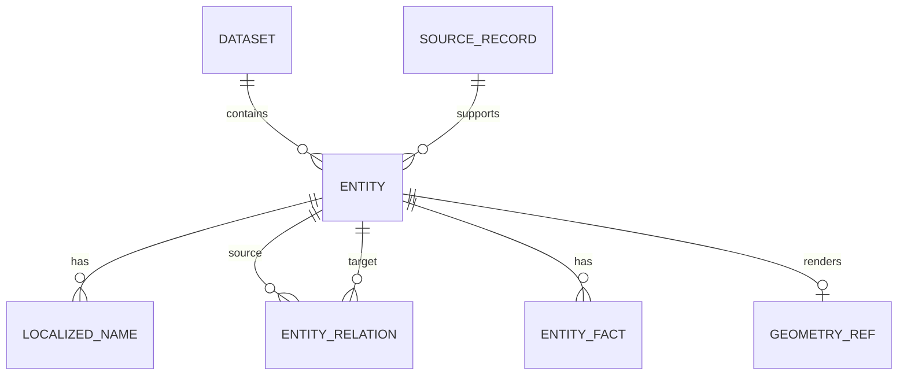
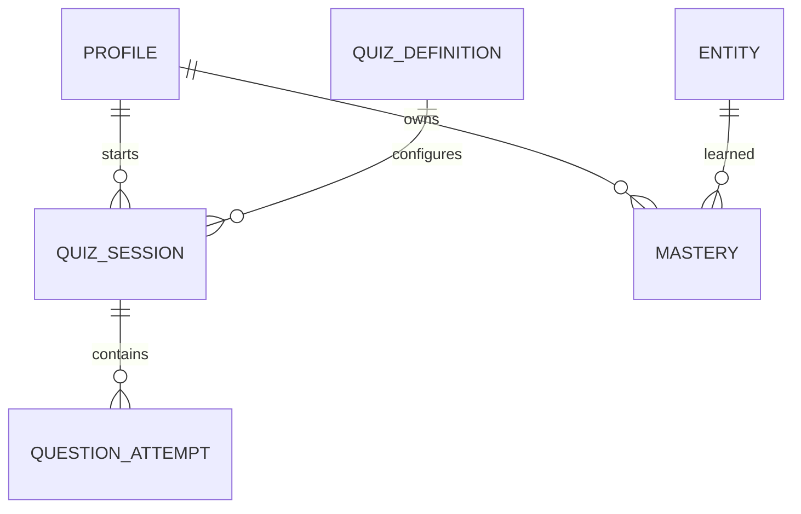

# Datenmodell

## Zwei getrennte Datenwelten

1. **Fachinhalte:** versionierte, überwiegend unveränderliche Geodaten.
2. **Nutzerdaten:** Sessions, Antworten, Einstellungen und Lernstand.

Der MVP liefert Fachinhalte als gebaute lokale Artefakte aus und speichert
Nutzerdaten im Browser. Ein späteres Backend spiegelt dieselben fachlichen
Grenzen, ohne den MVP davon abhängig zu machen.

## Fachmodell



### `dataset`

| Feld | Typ | Zweck |
|---|---|---|
| `id` | text | Stabile Dataset-Familie, z. B. `geo-core` |
| `version` | text | Unveränderliche Snapshot-Version |
| `built_at` | ISO-Zeit | Zeitpunkt des Builds |
| `schema_version` | integer | Formatmigration |
| `sources` | Liste | Quelle, Lizenz, Version, Abrufdatum, Prüfsumme |
| `attribution` | Liste | In der App anzuzeigende Hinweise |

### `entity`

| Feld | Typ | Zweck |
|---|---|---|
| `id` | text | Stabile interne ID, z. B. `country:de` |
| `type` | `EntityTypeId` | Registry-ID wie `country`, `river`, `volcano` |
| `canonical_name_id` | text | Fallback-Anzeigename |
| `centroid` | `[lon, lat]` optional | Kartenfokus und Punktfragen |
| `geometry_ref` | text optional | Verweis auf Geometrie-Feature |
| `difficulty` | integer 1–5 | Kuratierte Grundschwierigkeit |
| `active` | boolean | Im aktuellen Dataset abfragbar |
| `source_refs` | text[] | Rückverfolgung zu Quelldatensätzen |

Interne IDs basieren auf stabilen Standards oder Quell-IDs, nicht auf dem
aktuellen Anzeigenamen:

- Länder: `country:` + ISO-Alpha-2 in Kleinbuchstaben.
- GeoNames-Orte: `geonames:` + numerische GeoNames-ID.
- Natural-Earth-Features: eigener stabiler Import-Key plus Geometrie-Fingerprint.
- Kuratierte Entitäten: `curated:` + UUIDv7 oder dauerhaft reservierter Slug.

### `entity_type_definition`

Entitätstypen sind eine versionierte Registry, keine fest verdrahtete
Anwendungsliste:

| Feld | Typ | Beispiel |
|---|---|---|
| `id` | text | `volcano` |
| `geometry_kind` | text | `point` |
| `label_key` | text | Übersetzung |
| `supported_prompt_ids` | text[] | `name`, `map_highlight` |
| `supported_answer_mode_ids` | text[] | `text_input`, `map_point` |
| `icon_asset_key` | text optional | Themenicon |

Neue Typen mit bekannten Fähigkeiten benötigen damit nur Content. Eine neue
Interaktionsform benötigt zusätzlich ein registriertes Prompt-/Antwortmodul.

### `localized_name`

| Feld | Typ | Zweck |
|---|---|---|
| `id` | text | Stabile Alias-ID |
| `entity_id` | text | Zugehörige Entität |
| `locale` | BCP-47 | z. B. `de`, `de-AT`, `en` |
| `name` | text | Sichtbare Schreibweise |
| `kind` | text | `preferred`, `official`, `short`, `historic`, `alias` |
| `answer_policy` | text | `display_and_accept`, `accept_only`, `display_only` |
| `valid_from` / `valid_to` | Datum optional | Historische Gültigkeit |

Normalisierte Suchwerte werden beim Build abgeleitet, nicht als redaktionelle
Wahrheit gepflegt.

### `entity_relation`

| Feld | Typ | Zweck |
|---|---|---|
| `id` | text | Stabile Relations-ID |
| `source_id` | text | Ausgangsentität |
| `relation_type` | text | z. B. `has_capital`, `located_in` |
| `target_id` | text | Zielentität |
| `valid_from` / `valid_to` | Datum optional | Zeitliche Gültigkeit |
| `source_refs` | text[] | Belege und Importherkunft |

Relationsrichtungen sind kanonisch. Beispielsweise zeigt `country
--has_capital--> city`; die Gegenrichtung kann von der Abfrage abgeleitet oder
explizit als `is_capital_of` materialisiert werden.

### `relation_definition`

| Feld | Typ | Zweck |
|---|---|---|
| `id` | text | z. B. `has_official_language` |
| `source_type_ids` | text[] | erlaubte Ausgangstypen |
| `target_type_ids` | text[] | erlaubte Zieltypen |
| `inverse_relation_id` | text optional | Gegenrichtung |
| `cardinality` | text | `one`, `many`, `time_dependent` |
| `label_key` | text | sichtbare Bedeutung |

Der Content-Build lehnt Relationen ab, deren Typen oder Kardinalität nicht zur
Definition passen.

### `entity_fact`

Fakten werden nur für echte, filter- oder abfragbare Daten verwendet:

| Feld | Typ | Beispiel |
|---|---|---|
| `entity_id` | text | `geonames:5128581` |
| `fact_type` | text | `population` |
| `value_number` / `value_text` | passend | `8804190` |
| `unit` | text optional | `people`, `m`, `km` |
| `as_of` | Datum optional | Bezugsdatum |
| `method` | text optional | `city_proper`, `gazetteer_value` |
| `source_ref` | text | Importdatensatz |

Bevölkerungswerte ohne Bezugsdatum und Methode dürfen nicht als präzise globale
Rangliste dargestellt werden.

### `fact_definition`

Damit zusammengesetzte Fragen keine inkompatiblen Werte vergleichen, beschreibt
jeder Faktentyp seine Semantik:

| Feld | Typ | Beispiel |
|---|---|---|
| `id` | text | `land_area_km2` |
| `value_type` | text | `number` |
| `canonical_unit` | text optional | `km2` |
| `comparison_policy` | text | `same_method_and_snapshot` |
| `temporal_policy` | text | `latest_common_year` |
| `missing_value_policy` | text | `exclude` |
| `description_key` | text | sichtbare Definition |

Eine Wissenspuzzle-Definition darf nur Fakten sortieren, deren Definition den
Vergleich erlaubt.

### Geometrien

Große Geometrien liegen nicht als riesige JSON-Felder in jeder Entität.

- Entwicklungs-Fixtures: kleine GeoJSON-Dateien.
- App-Build: vereinfachtes GeoJSON oder PMTiles/Vector Tiles je Umfang.
- `geometry_ref` enthält Dataset, Layer und stabile Feature-ID.
- Punkt, Fläche und Linie verwenden dasselbe WGS84-Koordinatensystem.
- Vereinfachte Darstellungsgeometrie und Bewertungsgeometrie dürfen getrennt
  sein, müssen aber dieselbe Entität referenzieren.

Der aktuelle Dataset-Stand verwendet Schema 4. `river`, `lake`, `sea`,
`mountain_range` und `peak` bleiben Registry-Einträge mit
`located_in`-Relationen. Ihre Rohgeometrien liegen in fünf getrennten,
manifestierten Artefakten; Entität und `geometry_ref.featureId` teilen dieselbe
stabile ID.

Schema 4 ergänzt:

- `sources` als Runtime-lesbare Quellenmetadaten;
- `factDefinitions` mit Typ, Einheit, Beschreibung und Vergleichspolitik;
- `facts` mit Entität, Wert, Methode, Bezugsdatum und Quellenreferenzen;
- `compiledKnowledgeQuestions` mit Prompt, stabiler Antwortentität,
  Erklärung, Evidenzzeilen und Quellen;
- `language` und `knowledge_question` als Registry-Typen sowie
  `has_official_language` und `has_answer` als validierte Relationen.
- `ranked_city` als Punktentität und `rankByScope` für reproduzierbare,
  scopespezifische Top-N-Mengen.
- `ranked_river` und `ranked_peak` als lazy Rangentitäten mit globalem
  `rankByScope.world`; Gipfel besitzen einen Punkt, Flusssysteme in diesem Pack
  bewusst keine vorgetäuschte Einzelgeometrie.
- `promptQualifier` für gleichnamige Punktziele; bei Städten wird der
  Ländercode gezeigt, ohne den akzeptierten Namen zu verändern.

Eine kompilierte Wissensfrage ist eine normale Entität. Ihr kanonischer Name
ist nur ein interner, stabiler Redaktionsname; der sichtbare Fragetext liegt im
kompilierten Wissensdatensatz. `has_answer` besitzt Kardinalität `one`.
Regionalscopes werden aus dem ermittelten Land als `located_in` auf die
Frageentität materialisiert. Dadurch kann die vorhandene Scope-Abfrage
Wissenspuzzles ohne eigenen Filterpfad auswählen.

### Lazy-Städtepack in Phase 7

Der Kern-Datensatz registriert `ranked_city` und erlaubt seine
`located_in`-Relationen, enthält aber noch keine der 6000 großen
Stadtentitäten. `RankedCityContentPack` trägt dieselbe `datasetVersion` und
ergänzt zur Laufzeit Quellen, Entitäten, Namen, Relationen, Faktdefinition und
Fakten. Der Parser validiert den Pack vor der Repository-Zusammenführung.

`rankByScope` ist eine partielle Zuordnung von `world` oder einer
Kontinent-ID zu einem positiven ganzzahligen Rang. Eine Entität darf daher
beispielsweise global Rang 314 und in Europa einen anderen Rang besitzen oder
nur in einer kontinentalen Top-1000-Liste vorkommen. Quizfilter vergleichen
immer den Rang des gewählten Scopes; Fehlertraining kann die konkrete
Entitäts-ID ohne Rangfilter erneut abfragen.

### Lazy-Physikranglistenpack in Phase 7

`RankedPhysicalContentPack` ergänzt je 100 `ranked_river`- und
`ranked_peak`-Entitäten, deutsche Namen/Aliasse und sechs Faktdefinitionen.
Flüsse besitzen `river-system-length-km`, `river-drainage-countries` und
`river-outflow`; Berge besitzen `peak-elevation-m`, `peak-countries` und
`peak-range`. Alle 100 Fakten eines Typs müssen Quelle, Methode und Datum
teilen. Der Parser verlangt außerdem, dass der kleinste eingeschlossene Wert
strikt über dem ersten ausgeschlossenen Wert liegt.

Eindeutige Wikipedia-Artikel werden intern über ihre Wikidata-ID stabilisiert.
Verweist ein Sammelartikel auf mehrere gelistete Systeme oder Gipfel, verlangt
der Refresh eine explizite lokale ID; eine Rangnummer ist nie die Identität.
`rankByScope.world` speichert den veröffentlichten Tabellenrang und darf bei
fachlichen Gleichständen mehrfach vorkommen.

## Quiz- und Lernmodell



### `quiz_session`

| Feld | Typ |
|---|---|
| `id` | text/UUIDv7 |
| `profile_id` | text optional im lokalen Gastmodus |
| `quiz_definition_id` | text |
| `quiz_definition_snapshot` | JSON |
| `dataset_version` | text |
| `seed` | text |
| `status` | `active`, `completed`, `abandoned` |
| `started_at`, `completed_at` | Zeitzonen-Zeitstempel |
| `score`, `max_score` | integer |

Der Konfigurations-Snapshot schützt historische Runden vor später geänderten
Presets. Seit Phase 4 speichert er eine `QuizRoundDefinition`: entweder eine
einzelne `QuizDefinition` oder eine `MixedQuizDefinition` samt vollständigen
Pooldefinitionen, Zuteilungsregeln und Seed. Die konkreten Fragen bleiben
zusätzlich im Session-Snapshot, sodass ein später geändertes Gewicht keine
historische Runde umsortiert.

### `question_attempt`

| Feld | Typ |
|---|---|
| `id` | text/UUIDv7 |
| `session_id` | text |
| `ordinal` | integer |
| `question_snapshot` | JSON |
| `answer_payload` | JSON |
| `status` | Bewertungsstatus |
| `score` | integer |
| `response_time_ms` | integer |
| `answered_at` | Zeitzone-Zeitstempel |
| `grader_version` | text |

Eindeutige Bedingung: `(session_id, ordinal)`. Der Foreign Key `session_id`
erhält einen Index.

### `mastery`

Lernstand ist eine abgeleitete, aktualisierbare Sicht auf Antworten.

| Feld | Typ |
|---|---|
| `profile_id` | text |
| `entity_id` | text |
| `skill_key` | text, z. B. `name_to_map_point` |
| `strength` | Zahl 0–1 |
| `attempts`, `correct_attempts` | integer |
| `last_seen_at`, `next_review_at` | Zeitzone-Zeitstempel |
| `algorithm_version` | text |

Primärschlüssel: `(profile_id, entity_id, skill_key)`. Für die
Wiederholungsqueue ist ein Index auf `(profile_id, next_review_at)` vorgesehen.

### Wiederholungsqueue v1 in Phase 4

Die aktuell ausgelieferte Queue behauptet noch kein `mastery` und benötigt
keinen neuen Store. Sie wird deterministisch aus `progress-event-v1`
abgeleitet: Pro `(entity_id, skill_key)` bleibt der jüngste Fehler offen, bis
ein späteres korrektes Ereignis ihn schließt. Offene Einträge werden nach dem
ältesten Fehler sortiert und über vorhandene QuizDefinitionen gestartet.
`strength`, Lernintervalle und `next_review_at` bleiben bewusst Phase 8.

### Konten, Sync und Erfolge

Das vollständige Schema für `profiles`, `devices`, `progress_events`,
`achievement_progress` und `achievement_unlocks` steht in
[`ACCOUNTS_AND_ACHIEVEMENTS.md`](ACCOUNTS_AND_ACHIEVEMENTS.md).

Wichtige Grenze:

- Sessions und Antworten sind die historischen Fakten.
- Mastery, Gesamtstatistiken und Achievement-Fortschritt sind daraus
  wiederaufbaubare Ableitungen.
- Freischaltungen besitzen stabile IDs und sind idempotent synchronisierbar.

## Browser-Speicher im MVP

- App-Inhalte: statische, cachebare Dateien mit Manifest.
- Laufende Session und Einstellungen: IndexedDB.
- Kleine UI-Präferenzen: nur wenn sinnvoll `localStorage`.
- Lernstand: IndexedDB, exportierbar als versioniertes JSON.
- Schema-Upgrades: explizite, getestete Migrationen.

Kein fachlicher Inhalt wird ausschließlich in React-State gehalten.

### Aktueller Browser-Speicher

Die Browserdatenbank `geoapp` verwendet Schema-Version 3:

| Object Store | Zweck |
|---|---|
| `sessions` | vollständige Definition-, Fragen-, Timing- und Versuchssnapshots |
| `meta` | aktive/letzte Session und stabile lokale Gastprofil-ID |
| `progress-events` | idempotente Rohereignisse je bestätigtem Versuch |
| `settings` | zuletzt gewähltes MVP-Setup |
| `quarantine` | ungültige persistierte Datensätze samt Validierungsproblemen |
| `identity` | stabile Installation, Gerät, Gastprofil und optionale Kontoverknüpfung |
| `sync-outbox` | noch nicht bestätigte Kopien stabiler Progress Events |
| `achievement-unlocks` | lokale oder serverbestätigte Freischaltungen |
| `sync-state` | stabile Import-Batch-ID und kontoabhängiger Backfillstatus |

Phase 7 benötigt keinen neuen Store und keine Migration: Eine pausierte
Top-1000- oder Top-100-Runde ist derselbe validierte Session-Snapshot wie jede
andere Runde. Die Fortschrittsansicht lädt den Städte- beziehungsweise
Physikranglistenpack nur dann nach, wenn vorhandene Ereignisse `ranked_city`,
`ranked_river` oder `ranked_peak` referenzieren, damit Anzeigenamen und
Fehlertraining auch nach einem Neustart auflösbar bleiben.

Der Upgradepfad aus Version 1 erhält vorhandene `sessions` und `meta` und
ergänzt die neuen Stores und Indizes. Beim Laden wird jeder
Session-/Question-/Attempt-Snapshot strukturell tief geprüft. Ein ungültiger
Datensatz wird nicht gerendert, sondern in `quarantine` verschoben und der
aktive Verweis entfernt.

Aktive monotone Zeitwerte werden vor dem Speichern eingerechnet und als
pausierter Snapshot abgelegt. Abgeschlossene Sessions erzeugen
`progress-event-v1` mit stabiler ID `progress:<attempt-id>`. Statistiken und
Fehlerlisten sowie die Wiederholungsqueue werden daraus berechnet; Phase 5
behauptet bewusst noch keinen Mastery-Wert. `QuizRoundDefinition`, visuelle
Asset-Referenzen und physische `entityType`-/Ziel-ID-Felder bleiben
JSON-serialisierbare Sessionfelder und erfordern deshalb keine
IndexedDB-Schemamigration. Ein Sessiontest speichert und restauriert die
`map_line`-Antwort mit stabiler Fluss-ID.

Die Migrationen für Version 1 → 2 und 2 → 3 sind umgesetzt. Version 3 übernimmt
die alte Gastprofil-ID und erzeugt Installation und Gerät beim ersten Zugriff.
Abgeschlossene Sessions schreiben Progress Events, Outbox und neue
Freischaltungen in derselben Transaktion. Ein Browsertest baut ein echtes
Version-2-Schema auf und prüft den verlustfreien Upgradepfad.

Eine allgemeine
Migrationsmatrix für künftig veränderte Session- und Dataset-Schemata bleibt
offen; siehe `C-017` in [`Critics.md`](../Critics.md).

## Postgres/Supabase-Zielschema nach dem lokalen MVP

Der Phase-3-Slice setzt den synchronisierbaren Kern aus `profiles`, `devices`,
`progress_events`, `achievement_unlocks` und `sync_import_batches` bereits als
Migration um. Sessions, Einstellungen, Mastery und weitere abgeleitete
Tabellen bleiben in der folgenden Zielmenge.

- Namen ausschließlich `lowercase_snake_case`.
- Interne Datenbank-IDs als `bigint identity`; extern/offline erzeugte
  Ereignis-IDs als zeit-sortierbare UUIDv7, sobald die Zielumgebung sie sauber
  unterstützt.
- `timestamptz` für alle Ereigniszeiten.
- `text` statt künstlicher `varchar(n)`-Grenzen.
- Check Constraints für Status- und Wertebereiche.
- Jeder Foreign Key bekommt einen passenden Index.
- Zusammengesetzte Indizes folgen echten Zugriffsmustern.
- Row Level Security schützt `quiz_sessions`, `question_attempts`, `mastery` und
  `progress_events`, Achievement-Fortschritt und Profile strikt nach
  `profile_id`.
- Öffentliche Fachinhalte sind lesbar, aber nur über die Datenpipeline
  beschreibbar.

## Exportformat für Lernfortschritt

```json
{
  "schemaVersion": 1,
  "exportedAt": "2026-07-30T12:00:00Z",
  "profile": { "displayName": "Gast" },
  "settings": {},
  "sessions": [],
  "mastery": [],
  "achievementUnlocks": [],
  "progressEvents": []
}
```

Importe werden validiert und zusammengeführt; sie überschreiben nicht blind
neuere lokale Daten.
