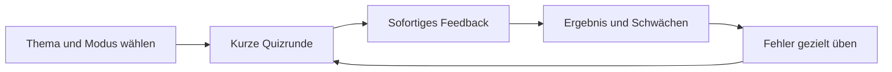

# Produktbild

## Vision

GeoApp soll die zentrale, spielerische Lernumgebung für allgemeine Geographie
werden. Lernende sollen denselben Stoff in verschiedenen Formen trainieren
können: erkennen, erinnern, eintippen, auf der Karte lokalisieren und unter
Zeitdruck abrufen.

„Alles“ bedeutet hier nicht, alle Inhalte gleichzeitig zu veröffentlichen.
Es bedeutet, die Plattform so zu bauen, dass neue Themen und Spielweisen ohne
Umbau der Grundarchitektur hinzukommen.

## Zielgruppen

1. Neugierige Jugendliche und Erwachsene, die aus eigenem Interesse lernen.
2. Schülerinnen und Schüler, die konkrete Regionen oder Themen üben.
3. Ambitionierte Spielerinnen und Spieler, die Zeit, Präzision und Vollständigkeit
   optimieren wollen.

Der erste Release benötigt weder Klassenverwaltung noch Lehrkraft-Dashboard.

## Spielerische Kernverben

- **Erkennen:** Flagge, Umriss, Kartenposition oder Namen zuordnen.
- **Erinnern:** Namen ohne vorgegebene Antwort eintippen.
- **Lokalisieren:** Punkt, Gebiet oder Verlauf auf der Karte auswählen.
- **Vergleichen:** Größe, Bevölkerung, Höhe oder Länge einordnen.
- **Kombinieren:** mehrere geographische Eigenschaften zu einer Lösung
  verknüpfen.
- **Meistern:** Fehler gezielt wiederholen und Fortschritt sichtbar erhöhen.

## Kernschleife

Eine normale Runde dauert 2–8 Minuten. Ein Marathon- oder 1000-Städte-Modus
darf länger dauern, ist aber nicht die Standarderfahrung.

## Inhaltslandkarte

| Bereich | Beispiele | Priorität |
|---|---|---:|
| Politische Geographie | Länder, Hauptstädte, Grenzen, Kontinente | 1 |
| Visuelle Zuordnung | Flaggen, Länderumrisse | 2 |
| Siedlungen | Hauptstädte, große Städte, Metropolen | 2–4 |
| Physische Geographie | Flüsse, Seen, Meere, Gebirge, Gipfel | 3 |
| Administrative Ebenen | Bundesländer, Staaten, Provinzen, Regionen | 5 |
| Erweiterungen | Inseln, Wüsten, Zeitzonen, Sprachen, Währungen | 5+ |
| Themenübergreifend | Weltmix und zusammengesetzte Wissenspuzzles | 3–6 |

## Produktprinzipien

- **Lernen vor Bestrafung:** Standardmodus ohne harte Leben; Zeitdruck ist eine
  wählbare Regel.
- **Aktive Erinnerung vor Raten:** Texteingabe und Kartenlokalisierung sind
  zentrale Modi, Multiple Choice dient Einstieg und Wiederholung.
- **Sofortiges, erklärendes Feedback:** Richtige Lösung, Entfernung oder
  Kartenlage zeigen; nicht nur rot/grün.
- **Kleine, kontrollierbare Umfänge:** Welt, Kontinent, Region und eigene
  Lernlisten müssen auswählbar sein.
- **Politisch transparent:** Grenz- und Gebietsdefinitionen werden versioniert,
  Quellen und Darstellungsregeln sind dokumentiert.
- **Deutsch zuerst, mehrsprachig vorbereitet:** Deutsche Anzeige- und
  Antwortnamen im MVP; das Datenmodell unterstützt weitere Sprachen.
- **Offline-fähiges Lernen:** Eine vorbereitete Runde soll ohne Live-Datenquelle
  funktionieren.
- **Fortschritt gehört den Lernenden:** Ohne Konto beginnen, später vollständig
  synchronisieren, exportieren und löschen können.
- **Erfolge aus dem System:** Abzeichen werden aus echten Lernereignissen und
  versionierten Regeln abgeleitet, nicht aus UI-Sonderfällen.

## Strategische Modi nach dem MVP

### Weltmix

Eine Runde wechselt kontrolliert zwischen Ländern, Hauptstädten, Flaggen,
Länderformen, den fünf Naturthemen und Wissenspuzzles. Große Städte und die
globalen Top-100-Ranglisten bleiben eigenständige Challenges. Gewichte,
Mindestanteile und Seed halten den Mix abwechslungsreich und reproduzierbar.

### Wissenspuzzle

Mehrere Relationen und Fakten führen zu genau einer erklärbaren Antwort, etwa:

> Welches ist nach Landfläche das zweitgrößte Land, in dem Portugiesisch
> Amtssprache ist?

Dieser Modus zeigt nach der Antwort die verwendete Definition, Faktenwerte,
Quelle und Bezugszeit.

### Abzeichensammlung

Themen-, Regionen-, Präzisions-, Serien-, Ausdauer-, Weltmix- und
Wissenspuzzle-Abzeichen geben langfristige Ziele. Familien und Stufen werden
datengetrieben erzeugt.

## MVP: erster vertikaler Schnitt

### Enthalten

- Themen: Länder und Hauptstädte.
- Richtungen:
  - Hauptstadtname → Position auf der Karte.
  - markierte Hauptstadt → Name eintippen.
  - Ländername → Landfläche anklicken.
  - markiertes Land → Name eintippen.
- Gebiete: Welt und einzelne Kontinente.
- Regeln: 10/20/alle Fragen, ohne Timer oder Zeit pro Frage.
- Feedback: korrekt/falsch, richtige Lösung, bei Punkten Entfernung.
- Ergebnis: Trefferquote, Zeit, Fehlerliste.
- Fortschritt: lokal pro Lernobjekt und Modus gespeichert.
- Bedienung: Desktop, Touch und Tastatur für alle Nicht-Karten-Aktionen.

### Nicht enthalten

- Accounts, Cloud-Sync, Multiplayer, Ranglisten oder Lehrkraftfunktionen.
- Vollständige 1000-Städte-Rangliste.
- Flüsse und Gebirge.
- Nutzererstellte Inhalte.
- Native iOS-/Android-Apps.

### Abnahmekriterien

- Jede der vier MVP-Kombinationen läuft über dieselbe Quiz-Engine.
- Eine mit Seed gestartete Runde erzeugt reproduzierbar dieselben Fragen.
- Akzeptierte deutsche Namensvarianten werden korrekt bewertet.
- Kleine Länder und nahe Hauptstadtpunkte sind auf Mobilgeräten fair anwählbar.
- Ein Neuladen verliert eine beendete Runde und den lokalen Fortschritt nicht.
- Keine Frage benötigt während der Runde eine externe API.

## Messgrößen nach dem MVP

- Anteil gestarteter Runden, die beendet werden.
- Wiederkehrende Nutzung innerhalb von 7 Tagen.
- Verbesserung der Trefferquote pro Entität.
- Häufigkeit von „unfair“ wirkenden Kartenfehlern.
- Zeit bis zur nächsten Frage und Ladezeit der Karte.

## Bewusste Produktgrenzen

- „Größte Städte“ braucht eine sichtbare Definition. Der geplante Modus verwendet
  zunächst die Bevölkerung des versionierten GeoNames-Snapshots, nicht eine
  scheinbar objektive Mischung aus Stadtgebiet und Metropolregion.
- Umstrittene Gebiete haben keine heimlich eingebaute „Wahrheit“. Dataset,
  Darstellungsregel und alternative Namen werden dokumentiert.
- Tippfehler-Toleranz darf keine fachlich andere Lösung akzeptieren.
